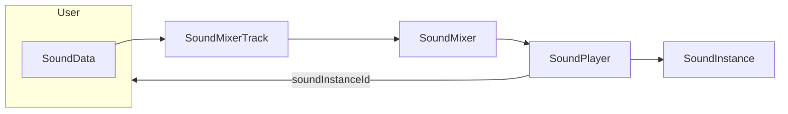

# Unity-Sound-Framework

This project is about giving sound designers and audio programmers a head start when working with Unity without third-party audio middlewares. It is currently in a very early stage of development, but I hope to grow it into something great, as it will be my package of choice for all future game projects. Cheers!

### Content

* Framework
  * Sound pipeline
  * Grouping and altering sounds
  * Control parameters
* Systems
  * Ambiance
  * Music
  * Footsteps

## Sound Pipeline

Every audio assets is wrapped in a `SoundData` ScriptableObject. This first layer allows for simple global settings around the asset, providing additional information and customization downstream.

These ScriptableObjects can then be played by being provided to a `SoundMixerTrack` , which is part of a bigger `SoundMixer`. The purpose of this layer is to map all sounds to `AudioMixer` tracks and allows for a few operations along the way, such as tagging, limiting, etc. The `SoundMixerTrack` and `SoundMixer` are really about forwarding a more documented `SoundRequest` to a place where it will eventually be played.

The `SoundPlayer` is that final destination before something comes out of the speakers, and it is where a `SoundInstance` will be produced, started and stored while it's playing. Each instance will be identified with an id that will be returned all the way to the requesting code at the `SoundMixerTrack` level, which could then be used to stop the sound, and potentially other things down the road.

`SoundPlayer` is then in charge of updating the state of the instances and of their time-based or code-driven effects. It is so far the only `MonoBehaviour` object mentioned.

### A little more about `SoundRequest`

This object carries all the information about how to play the `SoundData`: 

* How the volume and pitch should be altered with a `SoundVariation`
* What `SoundEmitter` should be its source
* How should that source be configured
* What `SoundControls` will be able to affect it
* What `AudioMixerGroup` does it belong to

## Control Parameters

...

## Ambiance system

...

## Footsteps system

...

## Music system

...

