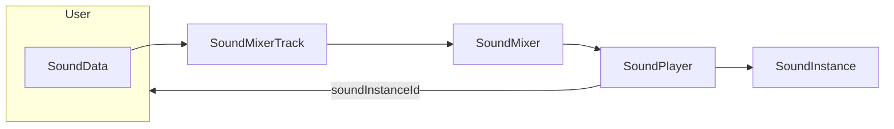

# Unity-Sound-Framework

This project is about giving sound designers and audio programmers a head start when working with Unity without third-party audio middlewares. It is currently in a very early stage of development, but I hope to grow it into something great, as it will be my package of choice for all future game projects. Cheers!

### Content

* Framework
  * [Sound pipeline](#Sound-Pipeline)
  * [Control parameters](#Control-parameters)
* Systems
  * [Ambiance](#Ambiance)
  * [Music](#Music)
  * [Footsteps](#Footsteps)

# Framework

## Sound Pipeline

### Basic units of sound

Every audio assets is wrapped in a `SoundData` scriptable object. This first layer allows for simple global settings around the asset, providing additional information and customization downstream.

A `SoundGroup` contains multiple sounds, and will play one of them when triggered based on various policies, whether randomly or sequentially, with a certain range of variations. 

Finally, a `SoundBank` is a collection of individual `SoundData` and `SoundGroup` that can be used to gather sounds elements around a certain topic in a single object.

### Playing a sound

These scriptable objects can then be played by being fed to a `SoundMixerTrack` , which is part of a bigger `SoundMixer`. The purpose of this layer is to map all sounds to `AudioMixer` tracks and allows for a few operations along the way, such as tagging, limiting, etc. The `SoundMixerTrack` and `SoundMixer` are really about documenting `SoundRequest` before bringing it to a place where it will eventually be played.

The `SoundPlayer` is that final destination before something comes out of the speakers, and it is where a `SoundInstance` will be produced, started and stored while it's playing. Each instance will be identified with an id that will be returned all the way to the requesting code at the `SoundMixerTrack` level, which could then be used to stop the sound, and potentially other things down the road.

### A little more about `SoundRequest` and `SoundPlayer`

The `SoundRequest` object carries all the information about how to play the `SoundData`: 

* How the volume and pitch should be altered with a `SoundVariation`
* What `SoundEmitter` should be its source
* How should that source be configured
* What `SoundControls` will be able to affect it
* What `AudioMixerGroup` does it belong to
* How it should fade-in

Each request reaching the `SoundPlayer` is then converted to a `SoundInstance` which is played and stored. This object is the only one inheriting from `MonoBehaviour` so far. Each time its update method is called, it will check every instance to see if it should be stopped or if its effects should be updated according to a time delta or a control parameter.

## Control parameters

Dynamic effects alteration is a key component of a responsive sound design. The `SoundControl` object is there for that purpose. It is built with an input/output mindset, where we have a control value on the input mapped to an effect value on the output. The control value can either be the distance between two game objects, or a `SoundParameter`  scriptable object, while the effect value corresponds to a parameter of an effect (such as a low-pass filter cutoff).

Both input and output parameters are specified with a range within which the input value will be clamped. The position of this value in the range will then be normalized from 0 to 1 and projected onto the output parameter range. This projection can be tweaked so it happens in a linear, exponential, logarithmic or custom fashion.

# Systems

## Ambiance

### Pads

...

### RFX

...

### Triggers and decoupling

...

## Music

### Marking a `MusicClip`

...

### Organizing music

...

## Footsteps

### Creating `FootstepData`

...

### Ground detection with tags or terrain layers

...

